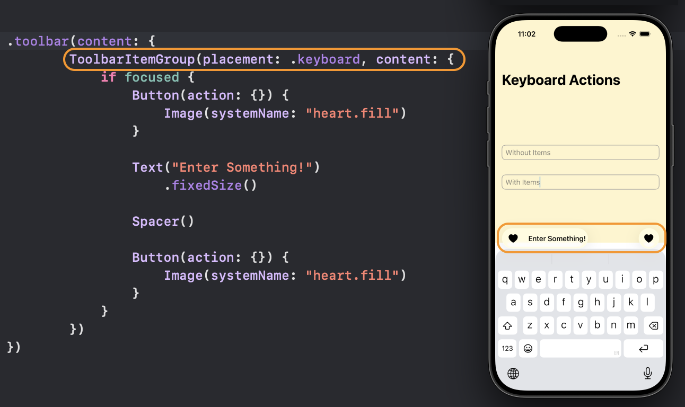

# SwiftUI_AdditionalKeyboardItems

A demo of adding additional items on the top of the keyboard on iOS, or to the Touch Bar on MacOS.

For more details, please check out my article [SwiftUI: Add Additional Items to Keyboard]()

